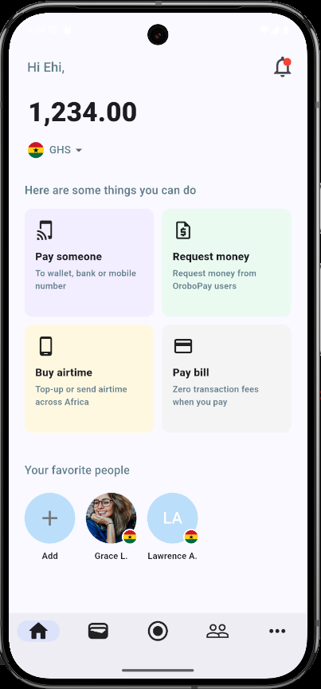

# OroboPay

**OroboPay** is a **Flutter-based wallet dashboard UI** developed as part of a technical selection task. The goal of this project is to demonstrate clean UI architecture, modular widget design, and basic state management using `provider`.  
> ⚠️ Note: This is a **static UI demo** — backend functionality and real-time data are **not** implemented.

🔗 **GitHub Repository**: [https://github.com/ChathuraJayakody/OroboPay](https://github.com/ChathuraJayakody/OroboPay)

## 📸 Preview



🔗 **GitHub Repository**: [https://github.com/ChathuraJayakody/OroboPay](https://github.com/ChathuraJayakody/OroboPay)

## 📱 Features (UI Only)

- 🔐 Wallet dashboard interface with currency balance
- 🌍 Country flag and currency selector via dropdown
- ⚡ Action cards: Pay Someone, Request Money, Buy Airtime, Pay Bill
- 👥 Favorite users section with avatars and flags
- 🧭 Bottom navigation bar with Material 3 components
- 🌈 Fully responsive and styled using Material Design principles

---

## 🧠 State Management with Provider

Used mainly for simple global state handling:

- `NavigationProvider`: Manages the selected tab in the bottom navigation
- `SettingsProvider`: Holds static user configuration (e.g., currency country)

---

## 🧩 Modular UI Components

- `BalanceCard`: Displays the wallet balance and a currency dropdown
- `ActionCard`: Reusable card showing different wallet actions
- `FavoriteAvatar`: Circular avatars with optional flag and name
- `BottomNavBar`: Material 3-style `NavigationBar` with reactive tab switching

---

## 🏗️ Project Structure

```plaintext
lib/
├── models/              # Data models (e.g., Country)
├── providers/           # State providers for settings/navigation
├── screens/             # HomeScreen and other main views
├── widgets/             # Reusable widgets (BalanceCard, ActionCard, etc.)
└── main.dart            # App entry point
